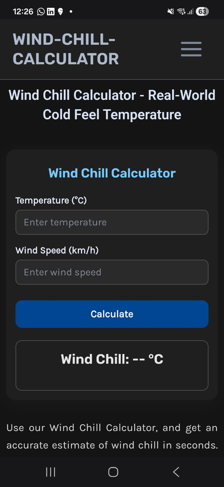
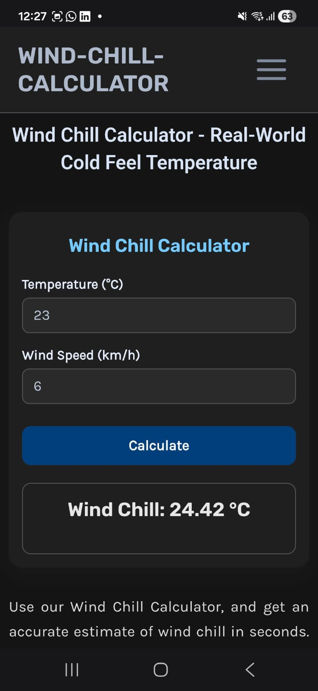

#Wind Chill Calculator – WordPress Plugin

A lightweight, fast and accurate Wind Chill Calculator plugin for WordPress.
It calculates how cold it actually feels by combining air temperature + wind speed using the official NOAA formula.

Perfect for weather websites, winter blogs, outdoor safety portals, hikers, travelers, students, and anyone who wants real-feel temperature instantly.

⭐ Features

✔ Accurate wind-chill calculation (NOAA formula)

✔ Responsive design

✔ Works with all WordPress themes

✔ Shortcode support

✔ Fast & lightweight

✔ Supports Celsius & Fahrenheit

🔧 Shortcode
Use this shortcode anywhere:
[wind_chill]

You can place it inside:
Posts
Pages
Sidebar Widgets
Elementor/Divi text block
Custom templates

📌 Installation
Manual Install:

Download the wind-chill-calculator plugin folder

Upload into:
/wp-content/plugins/

Activate the plugin from Plugins → Installed Plugins

WordPress Upload:

Compress plugin folder into ZIP

Go to Plugins → Add New → Upload Plugin

Upload ZIP → Install → Activate

📘 About This Plugin

This plugin uses the official wind-chill formula:

WCI (°F) = 35.74 + 0.6215T – 35.75(V^0.16) + 0.4275T(V^0.16)

Where:

T = Air Temperature

V = Wind Speed

It instantly shows you the "feels-like" temperature.

## Screenshots

### Wind Chill Calculator Input

### Result Screen

📝 Changelog
1.0.0

Initial Release

Added wind chill calculation

Added styles + frontend UI

Added shortcode

Email: (your email)

License

This plugin is distributed under the GNU General Public License v2 (GPL-2.0).
You are free to modify, distribute, and use commercially.
